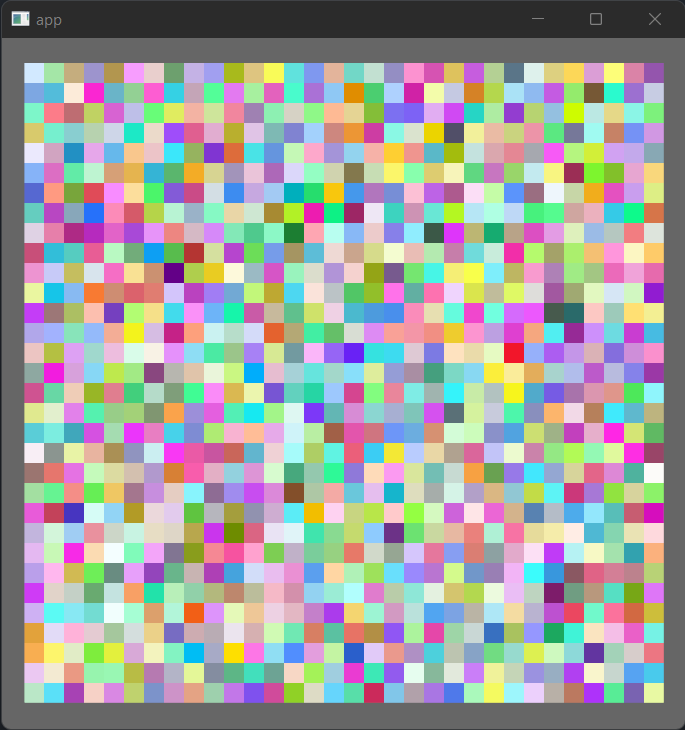

# bevy_pixel_buffer

[](https://crates.io/crates/bevy_pixel_buffer)
[](https://docs.rs/bevy_pixel_buffer/)


A library to draw pixels in [bevy](https://crates.io/crates/bevy).

- Easy to set up and use.
- Can be integrated into an existing project.
- Allows dynamic resize of the pixel buffer to fill an area such as the window.
- Support for multiple pixel buffers.
- Allows to easily attach a compute shader to update the pixels.
- [egui](https://crates.io/crates/egui) integration (through [bevy_egui](https://crates.io/crates/bevy_egui)) to show the pixels inside the UI.

## [Examples](./examples/)
A basic example,

```rust
use bevy::prelude::*;
use bevy_pixel_buffer::prelude::*;

fn main() {
    let size = PixelBufferSize {
        size: UVec2::new(32, 32),       // amount of pixels
        pixel_size: UVec2::new(16, 16), // size of each pixel in the screen
    };

    App::new()
        .add_plugins(DefaultPlugins)
        .add_plugin(PixelBufferPlugin)  // Add this plugin
        .add_startup_system(pixel_buffer_setup(size)) // Setup system
        .add_system(update)
        .run()
}

fn update(mut pb: QueryPixelBuffer) {
    // Set each pixel to a random color
    pb.frame().per_pixel(|_, _| Pixel::random());
}
```



[More examples](./examples/)

## Features
All features are enabled by default.
- `egui`. Egui integration.
- `rayon`. Enables extra alternative functions that use rayon.
- `rand`. Enables extra functionality related to random values.